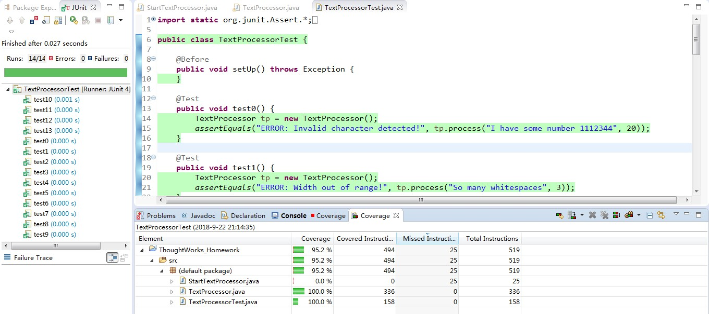

# 1 问题说明

本次作业的题目是一个小型文本预处理器，输入文本内容及指定宽度以后，对文本进行预处理以便后续进行固定宽度的排版。其中定义了如下的概念：
-  空白字符（white space）：指空格 '  '。
-  文本字符（character）：指大写或者小写的英文字母。
-  节（segment）：指一串（大于或者等于一个）连续的空白字符或者文本字符。

当给定宽度后，大于这个宽度的字符会被折行。而折行不会显示任何连字符（例如 “-”），也无需对 空白字符 进行额外处理。作业要求编写一个函数，该函数的输入为两个参数：

- 需要处理的文本
- 排版宽度。

该函数的返回值为预处理后的文本。预处理后的文本为每一节，及其所在的行号。中间以分号隔开。若一个节跨越了多行，则行号用逗号隔开，并从小到大进行排列。例如，假设输入为：

> The main theme of education in engineering school is learning to teach yourself，排版宽度指定为 30，

则输出为：

> The(1); (1);main(1); (1);theme(1); (1);of(1); (1);education(1); (1);in(1);(2);engineering(2); (2);school(2); (2);is(2); (2);learning(2,3); (3);to(3);(3);teach(3); (3);yourself(3);

# 2 构建代码

## 2.1 代码思想

要给每一节都标上其所在的行数，本人的思想是：

1. 首先将所给文本分节；
2. 然后需知道每一节的第一个和最后一个字符所在原文本中的位置；
3. 根据排版宽度求出每一节第一个字符和最后一个字符在排版后的文本中的所在行；
4. 根据每一节的首尾字符所在行得到此节所在的所有行；
5. 将每个节的内容及其所在的所有行依次按要求输出。

## 2.2 将文本分节

### 2.2.1 计算节数

首先先得到一共有多少个节，在这里使用正则表达式将文本以任意个连续空格分节：

```java
String[] strArr = text.split("\\s+");
```

可得到有多少个字母字符节，再通过判断原始文本首尾是否为空白字符得到节数segmentNum。

### 2.2.2 获取每一节的数据并存放

每一节的数据包括它的内容和尾字符在原始文本中的位置。在这里我定义了一个String[]类型的segmentArray用来存放每一个节的内容；定义了一个int[]类型的segmentLastCharNo用来记录每一节的尾字符在原始文本中的位置；定义segmentNo用来指示当前为第几个节。

遍历原始文本，若当前字符与下一个字符相比由 空白字符 变为 字母字符 或由 字母字符 变为 空白字符 时，认为当前字符为一个节的尾字符，下一个字符则为下一个节的开始，代码如下：

```java
for (int i = 0; i < text.length() - 1; i++) {
	char c1 = text.charAt(i);
	char c2 = text.charAt(i + 1);
	if ((c1 == ' ' && c2 != ' ') || (c1 != ' ' && c2 == ' ')) {
		segmentArray[segmentNo] += c1;
		segmentLastCharNo[segmentNo] = i;
		segmentNo++;
	} else {
		segmentArray[segmentNo] += c1;
	}
	if (i == text.length() - 2) {
		segmentArray[segmentNo] += c2;
		segmentLastCharNo[segmentNo] = i + 1;
	}
}
```

## 2.3 求每一节的首尾字符在原文本的位置

当知道每一节的内容及尾字符所在位置后，由内容长度可得该节首字符所在位置（用segmentFirstCharNo表示）：

```java
int segmentFirstCharNo = segmentLastCharNo[i] - segmentArray[i].length() + 1;
```

## 2.4 求每一节的首尾字符在排版后的文本中的行号

用原文本中字符的位置除以排版宽度并向下取整即为此字符在排版后文本中所在的行号。用此方法便可得到每一节的首尾字符的行号。

## 2.5 求每一节的行号

因为有的节可能会不跨行或跨多行，即节所在的行号可能为一到多个，因此为每一个节定义一个存储行号的int型数组segmentlines，从首字符所在行遍历至尾字符所在行，将行号填入segmentlines中，即可得到此节所有的行号。

## 2.6 输出结果

按上文所说，现在已经得到了存放所有节的数组segmentArray及每个节的所有行号，那么遍历segmentArray的元素并将其所在行号拼接成一个字符串，最后输出此字符串即可。

# 3 运行代码

上文实现了TextProcessor类，为调用此类，另编写文件StartTextProcessor.java文件，在此文件中通过main函数调用TextProcessor类。

将本项目文件导入编译器Eclipse，java版本为1.8，右键src文件夹下的StartTextProcessor.java文件，选择`Run As –> java application`，即可运行此代码。然后在控制台输入所要排版的文本与排版宽度，即可得到结果。

# 4 正确性验证

为了验证本次所编写代码的正确性，本人使用了单元测试这一方法。本次单元测试使用编译器Eclipse提供的插件EclEmma进行。EclEmma是一个免费的用来测试Java代码覆盖率的Eclipse插件，可以用EclEmma直接在Eclipse工作区中测试Java程序，分析代码覆盖率，并且在Java编辑器中高亮显示源文件的代码覆盖情况。

## 4.1 安装插件

在Eclipse中点击菜单`help –> Eclipse MarketPlace`，在对话框中搜索`EclEmma`后点击`Install`，按照提示下一步即可完成安装。安装完成后，出现图标如下图所示即为插件安装成功。


## 4.2 编写测试用例

在编写测试用例时，首先考虑异常输入，其次是正常输入能否返回正确的结果。为此，编写测试用例目录如下：

+ 当文本中出现 空白字符 或 文本字符 以外的字符时应输出相应错误信息；
+ 当输入宽度小于10时或大于80时应输出相应错误信息；
+ 当文本中有连续空格时仍能得到正确结果；
+ 当文本以空白字符开头或结尾时仍能得到正确结果；
+ 当文本中某一节可跨多行时仍能得到正确结果，即罗列出此节所在的所有行号；
+ 当文本为纯文本字符或纯空白字符时仍能得到正确结果；

## 4.3 测试结果

根据上文测试用例目录编写了14条测试用例，写在TextProcessorTest.java中，通过 EclEmma 运行后显示14条测试用例全部通过且代码覆盖率100%。



# 5 总结

首先开心的是顺利完成此次作业，并且通过了所有的测试用例。在完成此作业中又复习了Java的基础知识，以及单元测试的基础操作。

其次是对完成本次作业的过程的一些思考：在软件开发中，分析问题、拆分问题，无论所做的是大项目还是小项目，都对理清思路很有帮助。